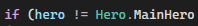
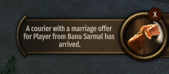
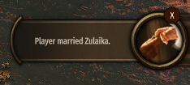
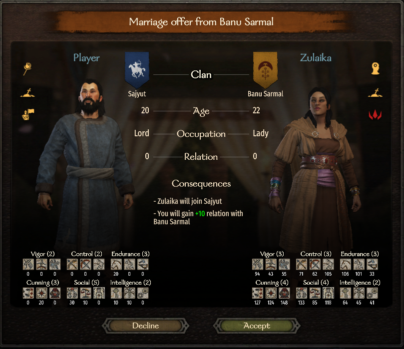
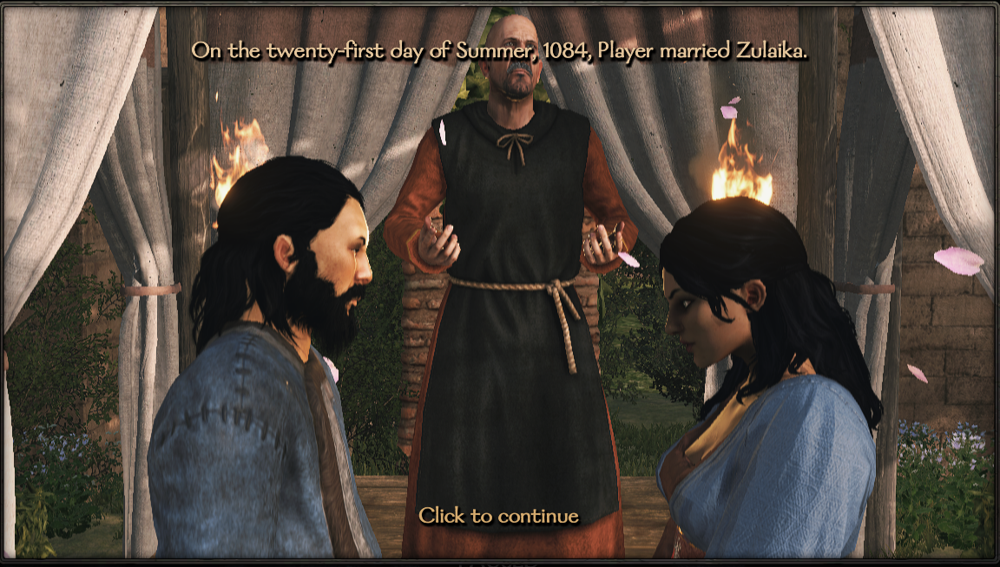
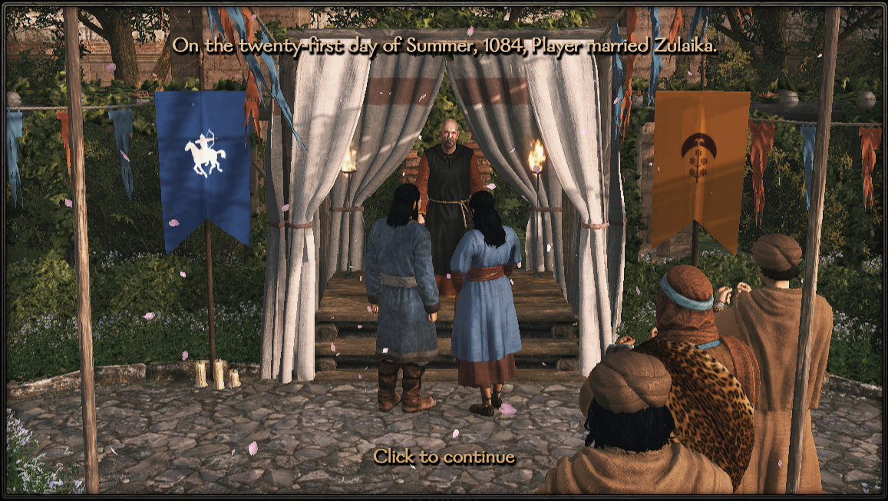
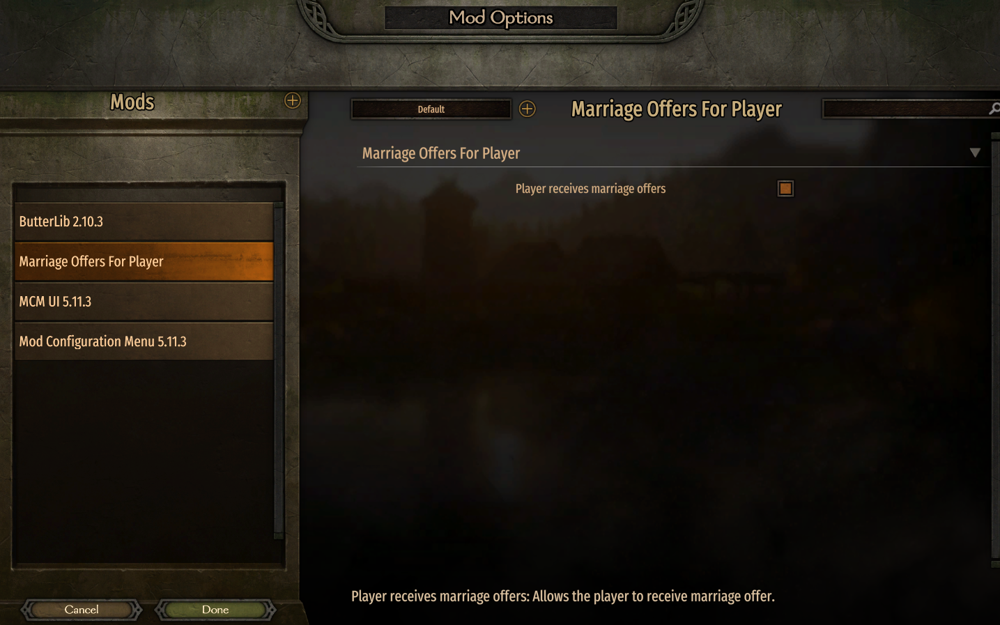

# Marriage offers for player

**Marriage Offers For Player** is a lightweight but essential improvement to Mount & Blade II: Bannerlord’s relationship and marriage system. In the base game, only your clan members can receive marriage proposals — the player character is strangely excluded from this feature.

**Why? “TaleWorlds” Why? I don't understand.**
 

## Youtube video

This mod fixes that limitation by enabling NPCs to send marriage offers directly to the player.
With this mod:

- NPCs can initiate marriage proposals to the player

- You can accept these offers and quickly get married

- The world feels more reactive and immersive

- The marriage system becomes more balanced and logical

If you ever felt that the player should be treated the same as any other lord in Calradia, this mod finally makes it happen. Simple, lore-friendly, and fully compatible with most campaign systems.

## Screenshots

    
    
     
    
    
    
    
    

## Requirements

* [Mount & Blade II: Bannerlord](https://www.taleworlds.com/tr/Games/Bannerlord) >= 1.3.x version.
* [Harmony](https://www.nexusmods.com/mountandblade2bannerlord/mods/2006)
* [ButterLib](https://www.nexusmods.com/mountandblade2bannerlord/mods/2018)
* [UIExtenderEx](https://www.nexusmods.com/mountandblade2bannerlord/mods/2102)
* [Mod Configuration Menu](https://www.nexusmods.com/mountandblade2bannerlord/mods/612)

## Installation:
1. Extract archive using 7zip
2. Place in Mount & Blade II Bannerlord\Modules folder
3. Enable in launcher and organize alphabetically

**Compatibility:** Can be added/removed anytime.

**Nexus mods**: https://www.nexusmods.com/mountandblade2bannerlord/mods/9379

**Steam Workshop**: https://steamcommunity.com/sharedfiles/filedetails/?id=3620695688

## My other mods

* [No Fog Of War](https://www.nexusmods.com/mountandblade2bannerlord/mods/9355) Removes the **Fog of War** system and making all settlements and characters visible in the in-game encyclopedia.
* [Keep Your Clan Members After Marriage](https://github.com/mitrax215/Bannerlord.KeepYourClanMembersAfterMarriage) This mod makes your clan members stay in your clan after they get married.